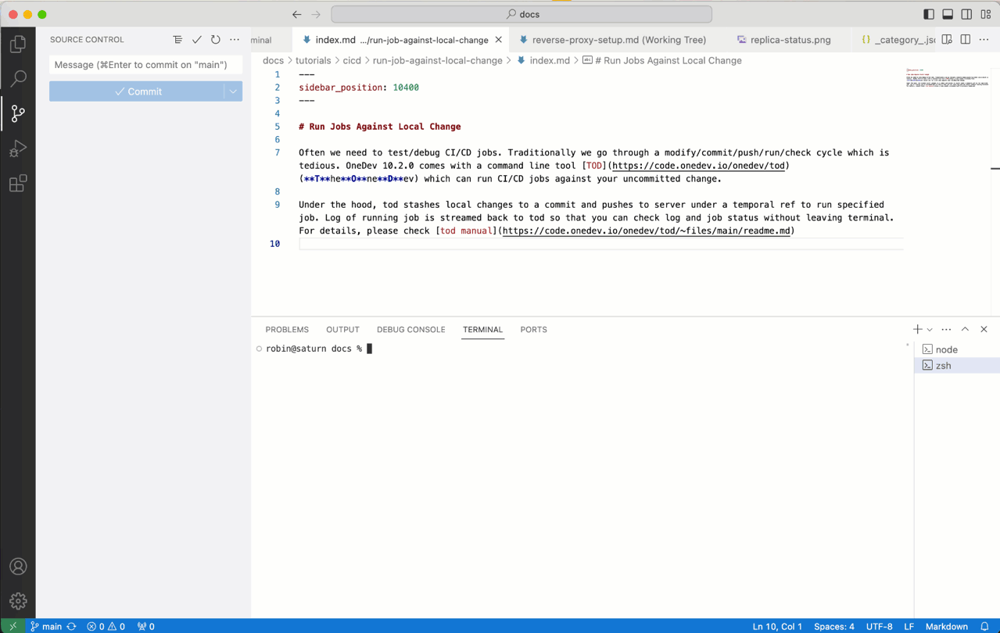

# What is TOD

TOD (**T**he**O**ne**D**ev) is a command line tool working with **OneDev 10.2** or higher

# Download

[Click here to select version and download](https://code.onedev.io/onedev/tod/~builds?query=%22Job%22+is+%22Release%22+and+successful)

# Build From Source

Make sure you have golang version 1.21.3 or higher installed. Clone the repositry, and run below command in repository root:

```
go build -o tod
```

# What It Can Do

## Run CI/CD Job Against Local Change

Tod is able to run CI/CD job against uncommitted code in your working directory to avoid the commmit/push/run/check loop. Under the hood, it stashes local changes to a commit and pushes to server under a temporal ref to run specified job. Log of running job is streamed back to tod  so that you can check job progress and status without leaving terminal.



### Command Syntax 

The syntax to build against local change is: 

```bash
tod exec -project <project url> -token <access token> -workdir <git working directory of the project> -param <name1>=<value1> -param <name2>=<value2> <job name>
```

If option `-workdir` is not specified, it will default to current directory. Other options are required if not already defined in config file (more on this later). 

Upon running the command, the terminal will display live log of the job, and you may press ctrl-c to terminate the command and the job will also be cancelled. 

**IMPORTANT:** If OneDev is running behind Nginx, make sure to configure Nginx to add a location directive for OneDev to disable http buffering like below to show log in time:

```
location /~api/streaming {
        proxy_pass http://localhost:6610/~api/streaming;
        proxy_buffering off;
}
```

Check [Nginx setup](https://docs.onedev.io/administration-guide/reverse-proxy-setup#nginx) for details.

### Example Command

Assume we have a OneDev project `https://onedev.example.com/my/project`. Build spec of the project defines a job `ci` with param `db` indicating database to test against. The project is cloned to directory `/path/to/my/project` for local development. To run job `ci` against local change in this directory, we first need to generate an personal access token from your account at OneDev, then run below command:

```bash
tod exec -project https://onedev.example.com/my/project -token <generated-access-token> -workdir /path/to/my/project -param db=<db type> ci
```

### Config File

We can put all or some of above options into file `$HOME/.tod/config` to avoid repeating them each time running the command. For instance, we can create the file with below content:

```ini
[exec]
project=https://onedev.example.com/my/project
token=<generated-access-token>
workdir=/path/to/my/project
param.db=<db type>
```

Now we can simply run `tod exec ci` to execute the job. We can still specify options though, and they will override same options specified in config file

### Security 

If the job needs to access some protected resources (job secret, groovy script, job executor etc), make sure authorizations of these resources include `non-pull-request commmits`. Simply authorizing the resource to branches is not enough, as the temporal ref used to run job does not belong to any branch

### Performance

Tod sends your local change to server to run the job. Follow below tips to speed up job execution to get fast feedback:

1. If your repository is large, specify appropriate clone depth of checkout step instead of cloning the whole history
1. If your job needs to download external resources, consider [caching](https://docs.onedev.io/tutorials/cicd/job-cache) downloaded resources. Intermediate files slow to generate may also be a good candidate for caching.